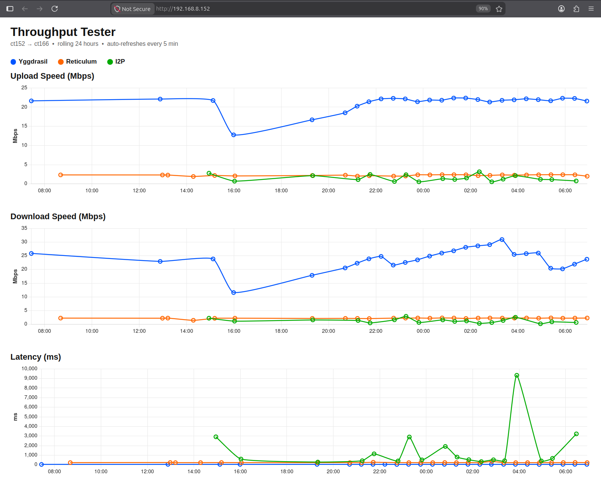

# Throughput Tester

Measures upload speed, download speed, and latency across four independent
transport layers between a set of always-on nodes. Each transport is tested
in isolation so results are directly comparable.

## Transports

| Transport | Mechanism | What it measures |
|-----------|-----------|-----------------|
| **TCP** | Raw TCP socket on LAN IP | Baseline — bare metal throughput |
| **Yggdrasil** | TCP socket over Yggdrasil IPv6 address | End-to-end overlay routing overhead |
| **I2P** | SAMv3 streaming via local i2pd daemon | Anonymising darknet layer (garlic routing) |
| **Reticulum (RNS)** | RNS Link + Channel API via public relay mesh | Reticulum protocol + relay hops |

RNS uses the public relay backbone for inter-site connectivity, keeping the
Reticulum measurement fully independent of the Yggdrasil measurement.

## Infrastructure

> **Note:** CT numbers, server names, hostnames, and LAN IP addresses below
> are specific to this deployment. On a different system these will all be
> different — only the software setup and port assignments matter.

### Nodes

| Node | Label | Proxmox host | LAN IP |
|------|-------|-------------|--------|
| ct107 | ct107 on x12-2 | x12-2 @ 192.168.8.60 | 192.168.8.107 |
| ct152 | ct152 on x11-3 | x11-3 @ 192.168.8.40 | 192.168.8.152 |
| ct166 | ct166 on x12-4 | x12-4 @ 192.168.177.20 | 192.168.177.166 |

All three are Debian 12 LXC containers. Each runs:
- **yggdrasil** — connected to the global Yggdrasil mesh
- **i2pd** — firewalled I2P node (`published=false`, client-only transport)
- **throughput-tester.service** — server listeners and RNS mesh node

**ct152 additionally runs:**
- **throughput-tester-web.service** — web dashboard on port 80, showing rolling
  24-hour graphs per transport pair with on-demand test buttons


- **throughput-tester-autotest.timer** — fires every 30 minutes, runs
  `thru test --to ct166 --transport ygg,rns,i2p` and stores results to
  `results.db`, feeding the graphs automatically

Services are enabled and survive reboot. The three RNS nodes form a complete
mesh via the public relay backbone with continuous announcements.

### Network topology

ct107 and ct152 share the `192.168.8.0/24` LAN and can reach each other via
raw TCP. ct166 is on a separate Proxmox host with a different subnet
(`192.168.177.0/24`) and is not directly reachable from the other two nodes
without WireGuard. **TCP tests to ct166 always fail by design** — Yggdrasil,
I2P, and Reticulum all work across this boundary.

## Observed performance

Measured between ct152 ↔ ct107 and ct152 ↔ ct166, after nodes have warmed up:

| Transport | Pair | Latency (avg) | Upload | Download |
|-----------|------|--------------|--------|----------|
| TCP | ct152↔ct107 | 0.3 ms | ~900 Mbps | ~420 Mbps |
| Yggdrasil | ct152↔ct107 | ~78 ms | ~19 Mbps | ~14 Mbps |
| Yggdrasil | ct152↔ct166 | ~48 ms | ~22 Mbps | ~23 Mbps |
| I2P | ct152↔ct107 | ~240–400 ms | ~1.5 Mbps | ~0.9 Mbps |
| I2P | ct152↔ct166 | ~600 ms | ~0.7 Mbps | ~1.2 Mbps |
| Reticulum | ct152↔ct107 | ~1 ms | ~90 Mbps | ~115 Mbps |
| Reticulum | ct152↔ct166 | ~232 ms | ~2.1 Mbps | ~2.2 Mbps |

RNS latency is measured over shared LAN TCP (ct152↔ct107) and public relay
hops (ct152↔ct166). Throughput reflects Channel API overhead and window size
(MDU 8111 bytes, window 2–5 packets).

## Usage

The `thru` wrapper is installed at `/usr/local/bin/thru` on each node.

```bash
# Test all transports to a peer
thru test --to ct107 --transport all

# Test specific transports (skip tcp when targeting ct166)
thru test --to ct166 --transport ygg,i2p,rns

# Show stored results
thru results
thru results --last 50
```

**Transport choices:** `tcp` `ygg` `i2p` `rns` `all`  
**Node choices:** `ct107` `ct152` `ct166`

Sample output:

```
[i2p] client session ready after 1 attempt(s)
[i2p] warmup: probing ct107...
[i2p] warmup OK in 4823 ms (attempt 1)

Testing  ct152 on x11-3  →  ct107 on x12-2
Transports: tcp, ygg, i2p, rns

--- TCP ---
  Latency:  avg 0.3 ms  min 0.1  max 0.7  jitter 0.2 ms
  Upload:   900.44 Mbps
  Download: 417.61 Mbps

--- YGG ---
  Latency:  avg 78.3 ms  min 75.6  max 82.6  jitter 2.5 ms
  Upload:   19.00 Mbps
  Download: 10.17 Mbps

--- I2P ---
  Latency:  avg 239.5 ms  min 165.0  max 457.3  jitter 89.4 ms
  Upload:   1.59 Mbps
  Download: 0.90 Mbps

--- RNS ---
  Latency:  avg 1.4 ms  min 1.2  max 1.9  jitter 0.2 ms
  Upload:   95.28 Mbps
  Download: 115.10 Mbps
```

Each transport has a per-transport timeout (default 300 s, configurable via
`transport_timeout_s` in `config.json`). A transport that fails or takes too
long is skipped with a clear message and does not block the others.

To view historical results separately, use `thru results [--last N]`.

## Configuration

`config.json` is **not tracked in git** — it contains node-specific addresses
(Yggdrasil IPs, I2P destinations, RNS hashes). Use `config.template.json` as
the starting point.

```json
{
  "this_node": "ct107",
  "nodes": {
    "ct107": {
      "label":    "ct107 on x12-2",
      "tcp_host": "192.168.8.107",
      "ygg_host": "<yggdrasil-ipv6>",
      "i2p_dest": "<base64 destination>",
      "rns_hash": "<hex hash>"
    },
    "ct152": { ... },
    "ct166": { ... }
  },
  "ports": {
    "tcp_server": 9901,
    "ygg_server": 9902,
    "rns_port":   9903,
    "i2p_sam":    7656
  },
  "test": {
    "latency_pings":       10,
    "throughput_runs":      3,
    "throughput_mb":        2,
    "transport_timeout_s": 300
  }
}
```

## Architecture

```
runner.py server          ← systemd service, always running
  ├── tcp_tester.server()    binds LAN IP:9901
  ├── ygg_tester.server()    binds Yggdrasil IPv6:9902
  ├── i2p_tester.server()    SAMv3 persistent session via i2pd:7656
  └── rns_tester.server()    RNS destination + TCP server on LAN IP:9903

runner.py test --to <node> --transport <...>
  ├── init_i2p()             pre-creates client SAM session (1-hop tunnels)
  ├── warmup_i2p()           pre-flight probe — see I2P details below
  ├── init_rns()             attaches to running RNS instance (share_instance=Yes)
  └── for each transport:
        run client in thread with transport_timeout_s deadline
        print result / save to results.db

throughput-tester-autotest.timer  (ct152 only)
  └── fires every 30 min → thru test --to ct166 --transport ygg,rns,i2p

throughput-tester-web.service     (ct152 only)
  └── Flask app on port 80 → reads results.db → 24h graphs + on-demand tests

throughput-tester-cleanup.timer   (all nodes)
  └── fires daily at 03:15 UTC → cleanup.sh
        trims results.db to 7 days
        purges i2pd peerProfiles >30 days, netDb >14 days, tags >7 days
        warns to journal if /var/lib/i2pd exceeds 200 MB
```

### I2P details

The server uses a persistent private key (`i2p_keys/tester.keys`) so its
destination is stable across restarts. The client session is pre-created once
by `init_i2p()` before the test loop, so per-test overhead is only a SAM
`STREAM CONNECT` rather than a full session build each time.

Tunnel configuration (written as SAM session options):

```
inbound.length=1  outbound.length=1   # 1-hop: higher build success on firewalled containers
inbound.quantity=8  (server)          # 8 inbound tunnels reduce "all tunnels expire" risk
inbound.quantity=3  (client)          # 3 outbound tunnels are sufficient for initiating
```

All nodes run i2pd with `ntcp2 published=false` and `ssu2 published=false`
because LXC containers behind NAT cannot accept inbound transport connections.
The nodes still build outbound tunnels and participate normally as clients.
ct166 runs with `bandwidth=P` (higher than the default L) to help LeaseSet
publication propagate to the wider floodfill network.

**I2P warm-up (initial startup):** After a fresh i2pd start, expect 30–60
minutes before tunnel build success rates stabilise and the node's LeaseSet is
reliably findable by peers. During this window the I2P test may timeout and
skip. Nodes that have been running for several hours are fully functional.

**Pre-test warmup probe (`warmup_i2p`):** Even on a fully warmed-up node, a
LeaseSet expires every 10 minutes. If the 30-minute autotest timer fires at the
exact moment the remote node's LeaseSet has expired and not yet been re-fetched
by floodfills, the test encounters `CANT_REACH_PEER` and falls back through the
retry logic, producing artificially high latency figures (90 s+ max spikes were
observed). To prevent this, `warmup_i2p()` opens a throwaway SAM stream to the
target, sends a PING, and closes it — all before the timed measurement begins.
This forces the LeaseSet lookup and tunnel build to complete during the warmup
rather than during the measurement. The warmup output appears before the test
results and retries up to 3 times with 5 s gaps; if all three fail the test
proceeds anyway (the failure is already known at that point).

**Client STREAM CONNECT retry:** `client()` retries the SAM `STREAM CONNECT`
up to 3 times with a 5 s gap, so transient `CANT_REACH_PEER` responses
(common during tunnel rebuild windows) are handled without failing the whole
test run.

### Reticulum details

Each node runs a full RNS instance with `enable_transport = True` and
`share_instance = Yes`. The tester client attaches to the already-running
service instance rather than opening its own connections, so there is no
TCP port conflict and the routing table is pre-populated from the service's
uptime.

RNS config interfaces (per node, at `rns_config/config`):

| Interface | Type | Target |
|-----------|------|--------|
| `noDNS1` | TCPClientInterface | 202.61.243.41:4965 |
| `noDNS2` | BackboneInterface | 193.26.158.230:4965 |
| `rns.beleth.net` | TCPClientInterface | rns.beleth.net:4242 |
| `rns.styrene.io` | TCPClientInterface | rns.styrene.io:4242 |
| `rns.dismail.de` | TCPClientInterface | rns.dismail.de:7822 |
| `TCP LAN Server` | TCPServerInterface | node's LAN IP:9903 |
| `TCP to <peer>` | TCPClientInterface | peer LAN IP:9903 (ct107↔ct152 only) |

The Channel API uses flow-controlled 6 000-byte messages (well under the
8 111-byte MDU). The sender always checks `channel.is_ready_to_send()` before
sending, especially after an upload burst, to avoid `ChannelException(ME_LINK_NOT_READY)`.

## Project files

| File | Purpose |
|------|---------|
| `runner.py` | Unified CLI — `server` / `test` / `results` subcommands |
| `tcp_tester.py` | TCP baseline test |
| `ygg_tester.py` | Yggdrasil test |
| `i2p_tester.py` | I2P SAMv3 streaming test |
| `rns_tester.py` | Reticulum RNS test |
| `socket_tester.py` | Shared TCP socket test logic (used by tcp + ygg) |
| `common.py` | Config loader, SQLite result storage, table formatter |
| `web_ui.py` | Flask web dashboard — 24h graphs and on-demand test trigger |
| `cleanup.sh` | Daily cleanup script — trims results.db and i2pd storage |
| `config.template.json` | Template with blank endpoint addresses |
| `config.json` | Live config with real addresses — **gitignored** |
| `rns_config/` | Per-node RNS daemon config — **gitignored** |
| `i2p_keys/` | Persistent I2P identity keys — **gitignored** |
| `install.sh` | Provisioning script for a new node |
| `throughput-tester.service` | systemd unit — server listeners (all nodes) |
| `throughput-tester-web.service` | systemd unit — web dashboard (ct152 only) |
| `throughput-tester-autotest.service` | systemd unit — autotest oneshot (ct152 only) |
| `throughput-tester-autotest.timer` | systemd timer — fires every 30 min (ct152 only) |
| `throughput-tester-cleanup.service` | systemd unit — daily cleanup oneshot (all nodes) |
| `throughput-tester-cleanup.timer` | systemd timer — fires daily 03:15 UTC (all nodes) |
| `playbook.md` | Full step-by-step deployment guide |
| `results.db` | SQLite results database — **gitignored** |

## Deployment

See `playbook.md` for the full procedure. Quick overview:

1. Clone a Debian 12 CT from a template, assign IP and hostname
2. `apt install git && git clone https://github.com/fotografm/throughput-tester /opt/throughput-tester`
3. `bash /opt/throughput-tester/install.sh <node-id>`
4. Collect addresses: Yggdrasil IPv6, RNS hash, I2P destination
5. Add the new node to `config.json` on all existing nodes; copy updated config to new node
6. Enable services: `throughput-tester` on all nodes; `throughput-tester-web` and
   `throughput-tester-autotest.timer` on the designated autotest node

UFW rules required on each node:

```bash
ufw allow 9901/tcp   # TCP test listener
ufw allow 9902/tcp   # Yggdrasil test listener
ufw allow 9903/tcp   # RNS server interface
```

## Results database

```sql
CREATE TABLE results (
    id INTEGER PRIMARY KEY,
    transport TEXT, from_node TEXT, to_node TEXT,
    timestamp REAL,
    latency_avg_ms REAL, latency_min_ms REAL,
    latency_max_ms REAL, latency_jitter_ms REAL,
    upload_mbps REAL, download_mbps REAL,
    notes TEXT
);
```

Results are retained for 7 days, trimmed automatically by the daily cleanup
timer. Query manually with `thru results [--last N]` or inspect `results.db`
directly with any SQLite tool.
